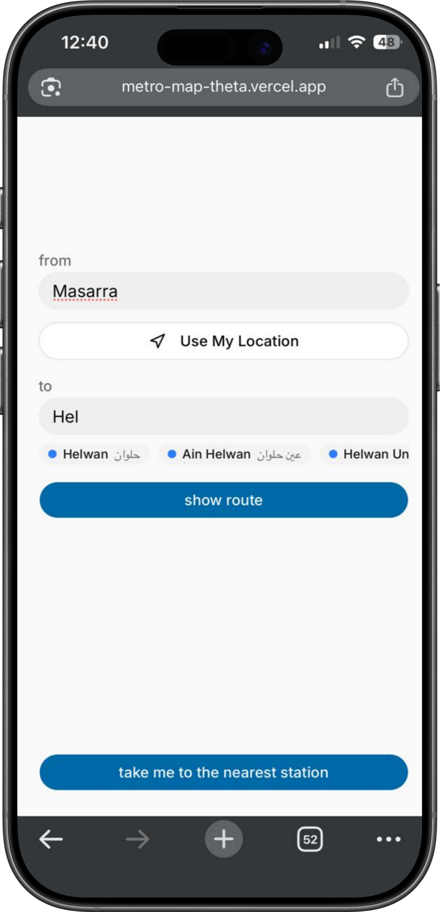
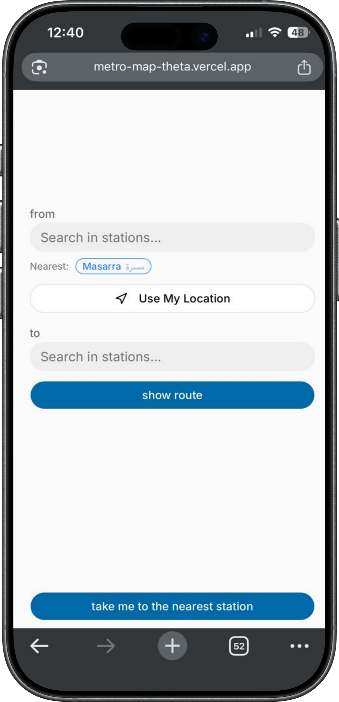

# Cairo Metro Route Finder 🚇

A modern Cairo Metro route planner built with Next.js that helps users quickly navigate the metro system with smart routing, transfer guidance, travel time estimation, ticket pricing, and GPS-powered nearest station detection.

## 🌍 Live Demo

🔗 https://metro-map-theta.vercel.app/

---

# 📸 Screenshots

## 🚇 Main Screens

<p align="center">
  
  
  
</p>

---

## 📱 Desktop Screenshots

<p align="center">
  
  
</p>

# ✨ Features

## 🚇 Smart Route Planning
- Find the optimal route between any two stations
- Supports all Cairo Metro lines
- Transfer-aware route calculation
- Fast client-side pathfinding

---

## 🔁 Intelligent Transfers
- Automatically detects line changes
- Shows:
  - Transfer stations
  - Which line to switch to
  - Travel direction toward terminal stations

Example:

```txt
Line 2 → Direction: Shubra El-Kheima
```

---

## 📍 GPS & Nearest Station
- Detects the user's current location
- Finds the closest metro station
- Opens walking directions directly in Google Maps

---

## ⏱️ Travel Time Estimation
Trip duration is estimated using:
- Number of stations
- Transfer penalties
- Approximate metro speeds

---

## 💰 Ticket Price Calculation
Automatically calculates ticket prices using Cairo Metro pricing zones.

---

## 🌐 Bilingual Search
Search stations in:
- English
- العربية

---

## 📱 Responsive UI
Optimized for:
- Mobile
- Tablet
- Desktop

Built with a clean and modern UI using:
- Tailwind CSS
- shadcn/ui
- Lucide Icons

---

# 🛠️ Tech Stack

| Technology | Purpose |
|------------|---------|
| Next.js 16 | Framework |
| React 19 | UI Library |
| TypeScript | Type Safety |
| Tailwind CSS | Styling |
| shadcn/ui | UI Components |
| Lucide React | Icons |
| Geolocation API | GPS Support |

---

# 🧠 How It Works

## Metro Network as a Graph

The Cairo Metro system is modeled as an **undirected weighted graph**.

### Nodes
Each station contains:
- Station ID
- Arabic name
- English name
- Metro line
- Latitude & longitude

### Edges
Connections between adjacent stations include:
- Neighbor station
- Metro line information

---

## 🚀 Route-Finding Algorithm

The app uses a modified **Dijkstra/BFS hybrid algorithm** with a transfer penalty to prioritize practical routes with fewer transfers.

### Cost Formula

```txt
cost = stops + (transfers × 2.5)
```

This transfer penalty simulates real-world commuter preference by discouraging excessive line switching.

### Example

| Route | Stops | Transfers | Preferred |
|------|------|------|------|
| Route A | 10 | 0 | ✅ |
| Route B | 8 | 2 | ❌ |

Even though Route B has fewer stops, Route A is often faster and easier for passengers.

---

## 🧭 Direction Detection

After generating the route, the algorithm walks forward along each metro line to determine the terminal station direction shown to the user.

Example:

```txt
Line 1 → Direction: Helwan
```

---

# 🚀 Getting Started

## 1️⃣ Clone the Repository

```bash
git clone https://github.com/progymer/metro-map.git
```

---

## 2️⃣ Install Dependencies

```bash
cd metro-map
npm install
```

---

## 3️⃣ Start the Development Server

```bash
npm run dev
```

Open:

```txt
http://localhost:3000
```

---

# ⭐ Support

If you found this project useful, consider:
- Starring the repository
- Sharing it with others
- Contributing improvements

---

<p align="center">
  Made with ❤️ for Cairo commuters
</p>
